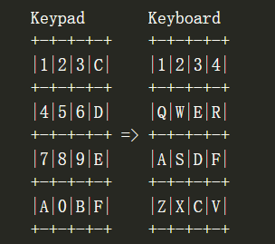

# CHIP-8 模拟器

仿照教程做的https://austinmorlan.com/posts/chip8_emulator/

## 如何使用

以windows下为例：

```shell
chip8.exe <Scale> <Delay> <ROM文件地址>
```

Scale：Chip-8的显示屏是64x32的，乘以Scale之后就是你显示屏上的分辨率。
Delay：Chip-8没有指定时钟速度，Delay用于确定周期之间的时间（毫秒），不同的游戏有不同的速度。

## CHIP-8架构

* 16个8-bit Register，labeled V0 to VF

* 4KB Memory（memory address: 0x000-0xFFF）
  * 0x000-0x1FF 起初为CHIP-8解释器保留，我们将不会用到这片区域
  
  * 0x050-0x0A0 存储16个内置字符（0到F），每个字符占5字节，共占0x50个字节，需要手动放入内存，ROM会查找这些字符
  
  * 0x200-0xFFF ROM将以0x200为起始存储，之后剩余的空间free to use
  
* 16-bit Index Register
  * 用于存储操作的内存地址
* 16-bit PC (Program Counter)

* 16-level Stack
  * 栈中仅保留PC，即函数调用不支持参数、返回值

* 8-bit Stack Pointer

* 8-bit Delay Timer
  * 计时器，有值时以60HZ的频率衰减，0时则维持为0。
* 8-bit Sound Timer
  * 行为同Delay Timer，到达0时发出buzz声
* 16 Input Keys
  * 
* 64\*32 Monochrome Display Memory

 